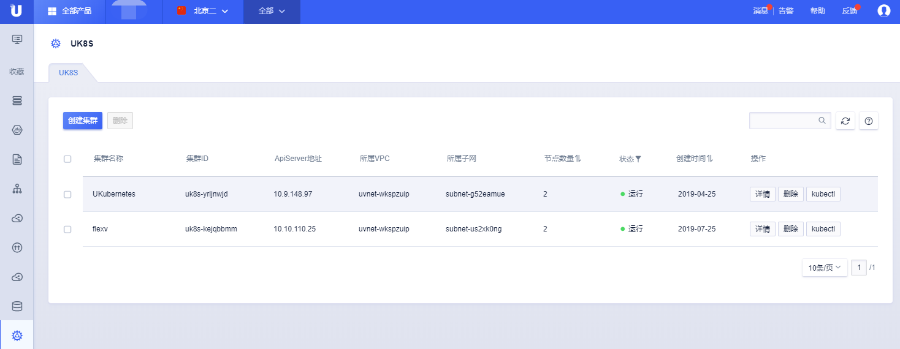
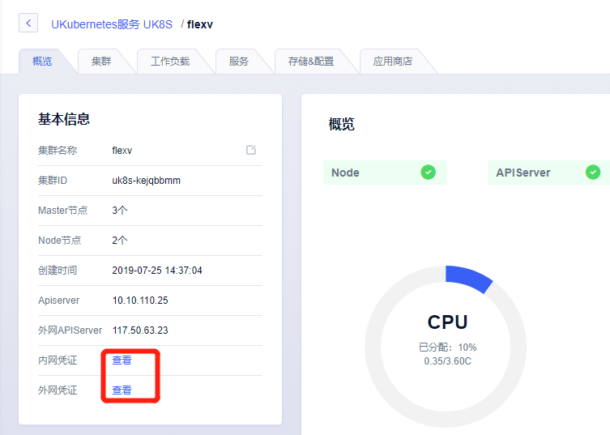
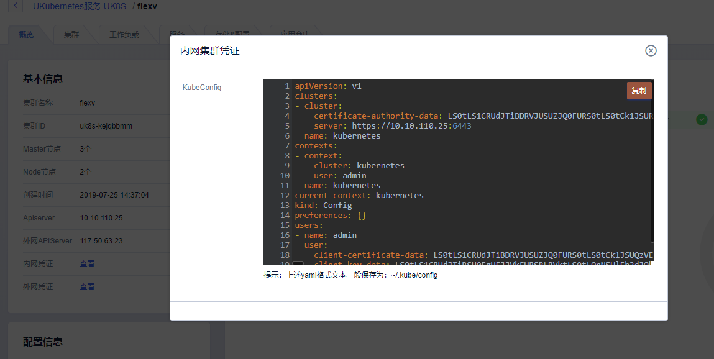

## game3 连接UK8S集群

### 初始化工作

1. 初始环境(工作人员)

    1.1 安装xshell

    1.2 ubuntu 18.04

    1.3 设置sudo不用密码:

    ```
    sudo vi /etc/sudoers
    ```

    1.4 添加`ubuntu  ALL = NOPASSWD: ALL`

### game 操作

1. 安装kubectl(已安装):

    1.1 下载对应版本的kubectl客户端
    
    ```
    curl -LO https://storage.googleapis.com/kubernetes-release/release/v1.13.5/bin/linux/amd64/kubectl
    ```

    1.2 赋予文件执行权限
    
    ```
    chmod +x ./kubectl
    ```
    1.3 移动二进制文件到指定目录中
    
    ```
    sudo mv ./kubectl /usr/local/bin/kubectl
    ```
    1.4 验证客户端安装成功
    
    ```
    kubectl version
    ```

2. 连接UK8S集群

    2.1 在console.ucloud.cn中查询创建好的集群。

    

    2.2 查看集群凭证

    

    2.3 复制集群凭证

    

    2.4 在ubuntu节点创建并黏贴集群凭证

    ```
    mkdir ~/.kube
    vi ~/.kube/config
    ```

    2.5 查看集群连接是否正常

    ```
    root@10-9-85-39:~# kubectl cluster-info
    Kubernetes master is running at https://10.10.110.25:6443
    CoreDNS is running at https://10.10.110.25:6443/api/v1/namespaces/kube-system/services/kube-dns:dns/proxy

    To further debug and diagnose cluster problems, use 'kubectl cluster-info dump'.
    ```
    
