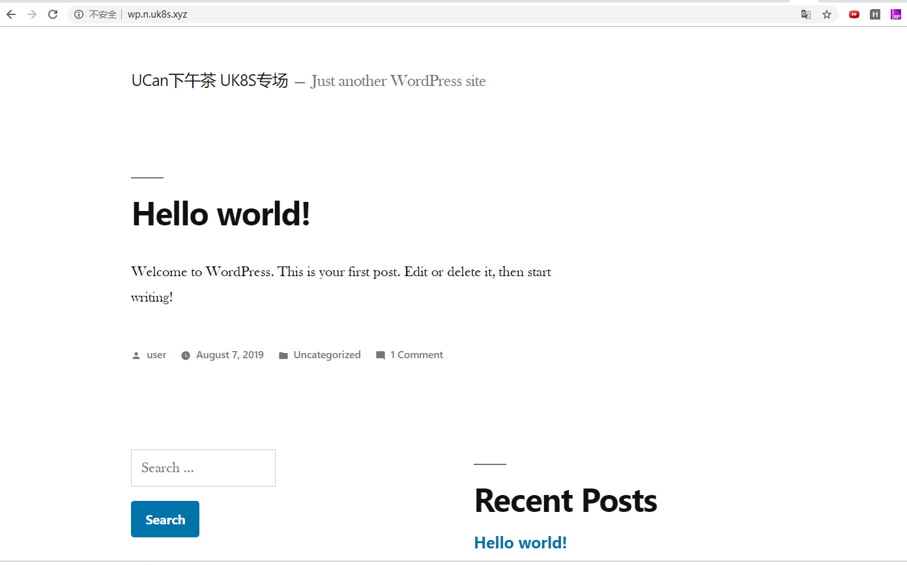

## game4 发布k8s应用

### game 操作

1. 安装ingress controller

    1.1 这里我们选择Nginx作为Ingress Controller，部署非常简单，执行以下指定即可:
    ```
    kubectl apply -f http://ethan-helloworld.cn-sh2.ufileos.com/ucan-ing-con.yaml
    ```

2. 发布应用

    2.1 下载yaml文件，修改为自己想要的namespace和访问域名
    ```
    wget http://ethan-helloworld.cn-sh2.ufileos.com/ucan-yibasuo.yaml
    ```

    2.2 修改yaml文件(可以跳过修改)

    ```
    vim ucan-yibasuo.yaml
    # 批量替换namespace
    :%s/ucannamespace/yourname/g
    # 查找显示域名
    /ucan.uk8s.xyz
    ```

    2.3 发布应用

    ```
    kubectl apply -f ucan-yibasuo.yaml
    ```

    2.4 查看是否运行成功

    ```
    root@10-10-117-71:~# kubectl get po -n ucannamespace
    NAME                            READY   STATUS    RESTARTS   AGE
    wp-mariadb-0                    1/1     Running   0          3m56s
    wp-wordpress-65b7c4dc58-57r7g   1/1     Running   0          3m56s

    ```

    2.4 访问 wp.ucan.uk8s.xyz查看你发布的应用

    

