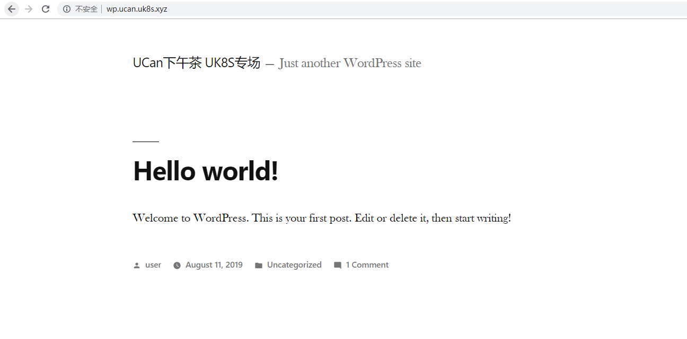

## game4 发布k8s应用

### game 操作

1. 安装ingress controller
    1.1 


2. 发布应用

    2.1 下载yaml文件，修改为自己想要的namespace和访问域名
    ```
    wget http://ethan-helloworld.cn-sh2.ufileos.com/ucan-yibasuo.yaml
    ```

    2.2 修改yaml文件(可以跳过修改)

    ```
    vim ucan-yibasuo.yaml
    # 批量替换namespace
    :%s/ucannamespace/yourname/g
    # 查找显示域名
    /ucan.uk8s.xyz
    ```

    2.3 发布应用

    ```
    kubectl apply -f ucan-yibasuo.yaml
    ```

    2.4 访问 xxx.ucan.uk8s.xyz查看你发布的应用

    
